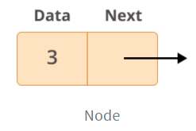
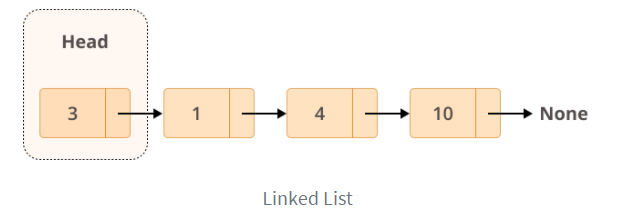
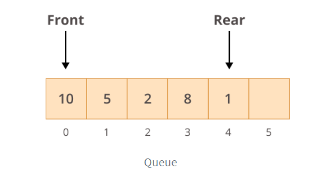
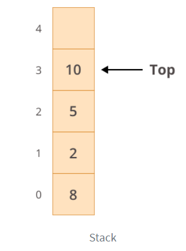

# Main Computer Science Concepts

## Nodes

### Nodes

__Data__: contains the value to be stored in the node.

__Next__: contains a reference to the next node on the list.

### Linked List

### Queue

>First-in / first-out approach (FIFO)
> 
First element inserted in the list is the first one to be retrieved

### Stack

>Last-in / first-out approach (LIFO)
> 
Last element inserted in the list is the first one to be retrieved

