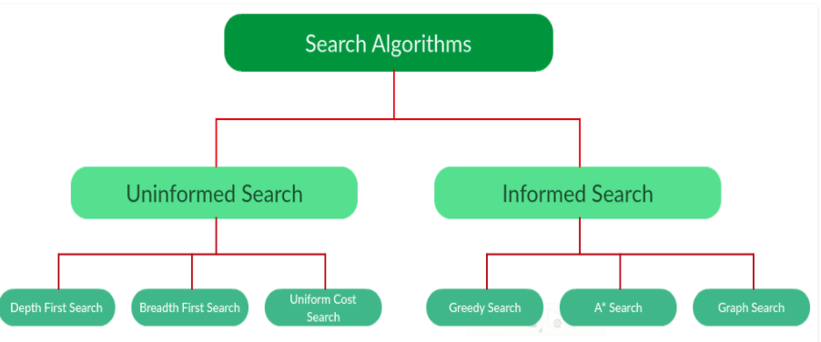
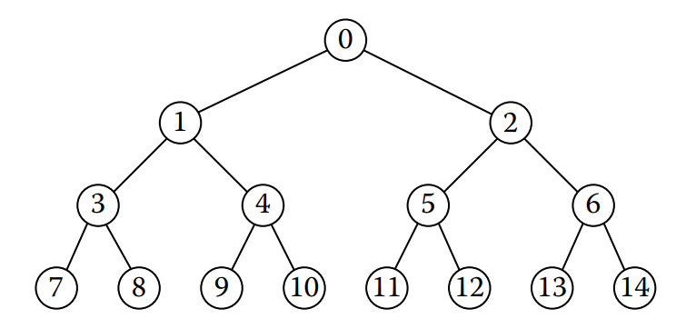
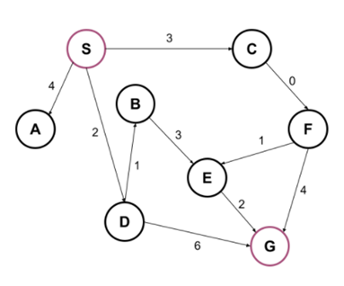
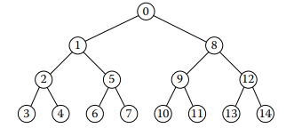
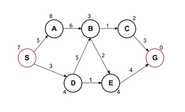

# Search Algorithms

**Search** - process of finding sequence of actions that transforms a start state into a goal state.

## Uninformed Search

### Breadth-First Search (BFS)

**_BFS_** finds the most efficient path to the goal based on the lowest number of edges.
BFS expands nodes in order of their depth from the root, generating one level of the tree at a time until solution is found.

> Manages the list as a first-in-first-out queue (FIFO)
> 

#### *BFS example*
**S**: start node; **G**: goal node

|          |     Queue               |     Visited   Nodes        |
|----------|-------------------------|----------------------------|
|     1    |     S                   |     S                      |
|     2    |     S->A, S->C, S->D    |     S, A                   |
|     3    |     S->C, S->D          |     S, A, C                |
|     4    |     S->D                |     S, A, C, D             |
|     5    |     S->C->F             |     S, A, C, D, F          |
|     6    |     S->D->B, S->D->G    |     S, A, C, D, F, B       |
|     7    |     S->D->G             |     S, A, C, D, F, B, G    |

### Depth-First Search (DFS)

**_DFS_** finds the fastest path to the goal based on the stack order.
DFS generates next a child of the deepest unexpanded node.

> Manages the list as a last-in-first-out stack (LIFO)
> 

#### *DFS example*

**S**: start node; **G**: goal node

|          |     Stack         |     Visited Nodes       |
|----------|-------------------|-------------------------|
|     1    |     S             |     S                   |
|     2    |     S->A          |     S, A                |
|     3    |     S->C          |     S, A, C             |
|     4    |     C->F          |     S, A, C, F          |
|     5    |     F->G, F->E    |     S, A, C, F, E       |
|     6    |     F->G          |     S, A, C, F, E, G    |

### Uniform-Cost Search (UCS)

**_UCS_** finds a path with the lowest cost (vs. BFS, finding a path with the lowest number of edges)

>Manages the list as a priority queue
>

### *UCS example*

**S**: start node; **G**: goal node

|          | Priority Queue |     Costs        |     Chosen Path    |     Visited Nodes             |
|----------|--------------|------------------|--------------------|-------------------------------|
|     1    | S            |     0            |                    |     S                         |
|     2    | S->D         |     2            |     YES            |     S, D                      |
|          | S->C         |     3            |                    |                               |
|          | S->A         |     4            |                    |                               |
|     3    | S->D->B      |     2+1=3        |     YES            |     S, D, B                   |
|          | S->C         |     3            |                    |                               |
|          | S->A         |     4            |                    |                               |
|          | S->D->G      |     2+6=8        |                    |                               |
|     4    | S->C         |     3            |     YES            |     S, D, B, C                |
|          | S->A         |     4            |                    |                               |
|          | S->D->B->E   |     2+1+3 =6     |                    |                               |
|          | S->D->G      |     2+6=8        |                    |                               |
|     5    | S->C->F      |     3+0=3        |     YES            |     S, D, B, C, F             |
|          | S->A         |     4            |                    |                               |
|          | S->D->B->E   |     2+1+3 =6     |                    |                               |
|          | S->D->G      |     2+6=8        |                    |                               |
|     6    | S->A         |     4            |     YES            |     S, D, B, C, F, A          |
|          | S->C->F->E   |     3+0+1=4      |                    |                               |
|          | S->D->B->E   |     2+1+3 =6     |                    |                               |
|          | S->C->F->G   |     3+0+4=7      |                    |                               |
|          | S->D->G      |     2+6=8        |                    |                               |
|     7    | S->C->F->E   |     3+0+1=4      |     YES            |     S, D, B, C, F, A, E       |
|          | S->C->F->E->G |     3+0+1+2=6    |                    |                               |
|          | S->D->B->E   |     2+1+3 =6     |                    |                               |
|          | S->C->F->G   |     3+0+4=7      |                    |                               |
|          | S->D->G      |     2+6=8        |                    |                               |
|     8    | S->C->F->E->G |     3+0+1+2=6    |     YES            |     S, D, B, C, F, A, E, G    |
|          | S->D->B->E   |     2+1+3 =6     |                    |                               |
|          | S->C->F->G   |     3+0+4=7      |                    |                               |
|          | S->D->G      |     2+6=8        |                    |                               |

## Informed (Heuristic) Search

**_Heuristic_** is an approximation to search more efficiently. A heuristic measure tries to approximate the distance from each node to the goal.
Heuristic evaluation function estimates cost of an optimal path between the states.

**_Admissible heuristics_** - always underestimate the true cost to the goal.
**_Informative heuristics_** - provides cues to where to direct the search; it helps to prioritize different nodes during heuristic search.

### Greedy Search
**_Greedy search_** tries to find a solution as fast as possible, using the smallest possible heuristic.
>**_Greedy algorithms_** aim to make the optimal choice at that given moment. Each step it chooses the optimal choice, without knowing the future. It attempts to find the globally optimal way to solve the entire problem using this method.
>
Greedy property: "At exact moment in time, what is the optimal choice to make?"

Greedy algorithms break down when:
- the heuristics are uninformative or too similar;
- the heuristics are inadmissible.

#### *Greedy search example*

**S**: start node; **G**: goal node

|     #    |     Priority Queue           |     Heuristic value    |     Chosen Path    |
|----------|------------------------------|------------------------|--------------------|
|     1    |     S                        |     7                  |     YES            |
|     2    |     S -> D                   |     4                  |     YES            |
|          |     S - > A                  |     8                  |                    |
|     3    |     S -> D -> B              |     3                  |     YES            |
|          |     S -> D -> E              |     4                  |                    |
|          |     S -> A                   |     8                  |                    |
|     4    |     S -> D -> B -> C         |     2                  |     YES            |
|          |     S -> D -> B -> E         |     4                  |                    |
|          |     S -> D -> E              |     4                  |                    |
|          |     S -> A                   |     8                  |                    |
|     5    |     S -> D -> B -> C -> G    |     0                  |     YES            |
|          |     S -> D -> B -> C         |     2                  |                    |
|          |     S -> D -> B -> E         |     4                  |                    |
|          |     S -> D -> E              |     4                  |                    |
|          |     S -> A                   |     8                  |                    |

### A* Search Algorithm
A* search combines elements of UCS with the pure heuristic search.

#### *A\* Search example*

**S**: start node; **G**: goal node

|     #    |     Priority Queue     |     Costs      |     Heuristic value    |     Summed Cost    |     Chosen Path    |
|----------|------------------------|----------------|------------------------|--------------------|--------------------|
|     1    |     S                  |     0          |     7                  |     7              |     YES            |
|     2    |     S -> D             |     3          |     4                  |     7              |     YES            |
|          |     S - > A            |     5          |     8                  |     13             |                    |
|     3    |     S -> D -> E        |     3+1=4      |     4                  |     8              |     YES            |
|          |     S -> D -> B        |     3+5=8      |     3                  |     11             |                    |
|          |     S -> A             |     5          |     8                  |     13             |                    |
|     4    |     S -> D -> E-> G    |     3+1+4=8    |     0                  |     8              |     YES            |
|          |     S -> D -> B        |     3+5=8      |     3                  |     11             |                    |
|          |     S -> A             |     5          |     8                  |     13             |                    |
